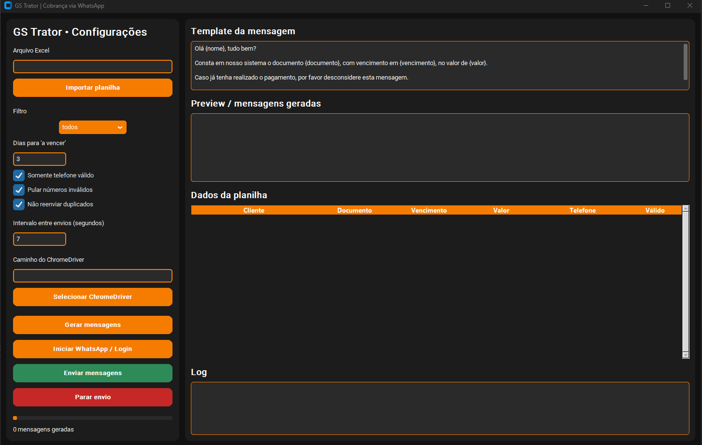

# 🚀 WhatsApp Billing Automation System

A complete automation system for business communication and payment collection.

Built with Python, this system automates customer messaging workflows using Excel data and intelligent filters.

---

## 🧠 Overview

This project is a real-world automation system used in a company environment to handle customer communication and billing processes.

It allows businesses to send automated WhatsApp messages based on financial data, improving efficiency and reducing manual work.

---

## 💼 Business Problem

Companies spend hours sending manual messages for:

- Payment reminders
- Overdue notifications
- Customer follow-ups

This system automates the entire process.

---

## ⚙️ Features

- 📊 Excel integration (customer data)
- 📩 Automated WhatsApp messaging
- 🧠 Smart filters:
  - Due payments
  - Overdue payments
- 🚫 Skip invalid numbers
- 🔁 Avoid duplicate messages
- ⏱️ Configurable sending interval
- 🖥️ Desktop interface (CustomTkinter)
- 📋 Real-time logs

---

## 🛠️ Tech Stack

- Python
- Selenium
- Pandas
- CustomTkinter
- Excel Integration

---

## 📸 Interface



---

## 🚀 How to Run

```bash
git clone https://github.com/sempre18/auto-reply-for-WhatsApp
cd auto-reply-for-WhatsApp

pip install -r requirements.txt
python main.py
````
---

## 💡 Real Business Use

This system is actively used in a company to automate customer billing communication.

It reduces manual work and increases operational efficiency.

---

## 👨‍💻 Author

Lucas Saccomanno
📧 lusaccomanno11@gmail.com

📍 Brazil
